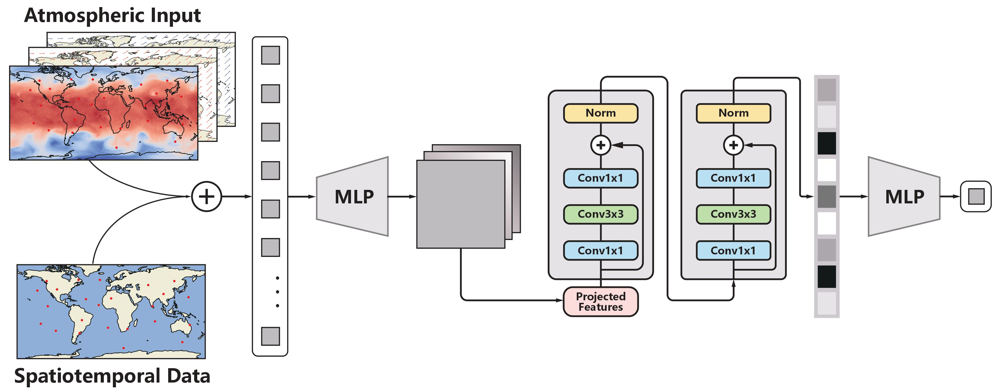

# SELF-ANN: Sporadic E Layer Forecast using Artificial Neural Networks

---

---

## Tool
There is an open-source tool[^1] based on **SELF-ANN**.

Feel free to [click here](http://149.28.154.104:8000/) to try to make a prediction for the sporadic E layer.

The efficacy of the tool spans a period from approximately **2002** to **2025**.

Contact email `rulenhao@mail.ustc.edu.cn` if there are any problems with the page.

## File description
| File      | Description |
| :---        |    :----  |
| dataset.py     | Construct training and test data. |
| inference.py   | Model inference after training. |
| model.py | Define the model structure. |
| train.py | Execution of training models. |
| torchrun_main.py | Main program, using DDP and multi-GPU parallel training.|
| ./images | The source code of latest version and other utility functions. |

## Data availability
The reanalysis data used for part of the input in this study are available from ECMWF Reanalysis v5 (ERA5).  
[https://www.ecmwf.int/en/forecasts/datasets/reanalysis-datasets/era5](https://www.ecmwf.int/en/forecasts/datasets/reanalysis-datasets/era5).  
The COSMIC RO data was downloaded from the FORMOSAT-3/Constellation Observing System for Meteorology Ionosphere and Climate (COSMIC-1).  
[https://www.cosmic.ucar.edu](https://www.cosmic.ucar.edu/).  
Geomagnetic and solar activity data are obtained from the OMNI Goddard's Space Physics Data Facility.  
[https://omniweb.gsfc.nasa.gov](https://omniweb.gsfc.nasa.gov/).

[^1]:The tool is an experimental application and may be suspended without any notification.
